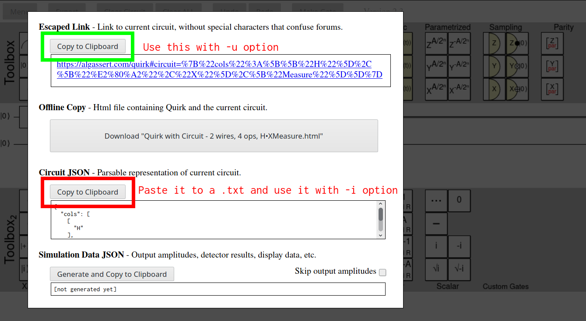

# pyquirk
A simple python program to convert graphical circuits to quantikz figures.


## Requirements
- Python 3+
- [quantikz](https://ctan.org/pkg/quantikz?lang=en): A LaTeX package for drawing quantum circuits. Here is its [manual](http://mirrors.ibiblio.org/CTAN/graphics/pgf/contrib/quantikz/quantikz.pdf).

##### How to manually install a new package on MikTeX on Windows?
If you do not know how to manually install a new TeX package to your system, these links may be of some help to you.
- [Windows with MikTeX](https://tex.stackexchange.com/questions/2063/how-can-i-manually-install-a-package-on-miktex-windows)
- [Linux](https://tex.stackexchange.com/questions/73016/how-do-i-install-an-individual-package-on-a-linux-system)
- [Mac with TeXShop](https://tex.stackexchange.com/questions/12102/how-do-i-install-ctan-packages-on-mac-os-with-texshop)

## 💾 Installation and Usage
Clone the repo for installing. `pyquirk.py` converts the JSON to TeX codes.

Copy and paste the JSON data of your circuit from [Quirk](https://algassert.com/quirk)(a toy quantum circuit simulator)
 into a `.txt` file as explained below. The output is formatted into a `.tex` file.

**Syntax:** `python3 pyquirk.py input.txt output.tex`

**For example:** In this repo, `python3 pyquirk.py circuit_json.txt circuit.tex`

Now you may include `circuit.tex` which contains only tikz environement in `main.tex` that supplements packages. Read below for clarity.

### Steps to generate the `.txt` file
**Step 1:** Click on `Export` button displayed on the header of [Quirk](https://algassert.com/quirk).


**Step 2:** `Copy to Clipboard` the JSON settings.



Paste this into a `.txt` file and this must be the input.

---

**After getting `output.tex`**

A short rundown of **quantikz** usage is given below. I assume this is the format of your main file in which the circuit should be included along with descriptions, equations and stuff.

**A minimal working example:**
```latex
\documentclass{article}
\usepackage{tikz}
\usetikzlibrary{quantikz}

\begin{document}
\begin{center}      %Optional centering

%(...circuit code from the output goes here...)
% you may as well just pipe the output file of pyquirk as input:

\input{output.tex}

% or you can completely copy-paste the output of pyquirk:

\begin{quantikz}
\lstick{\ket{0}}&\gate{H} & \ctrl{1} & \meter{}& \cw \\
\lstick{\ket{0}}&\qw & \targ{} & \qw& \qw
\end{quantikz}

\end{center}
\end{document}
```

Use the example files supplied if you have more doubts. Submit an issue if you find errors or need help!

## Future improvements
- Parsing from algassert URL.
- A dedicated website for generating tex code after pasting JSON.

## Acknowledgement
- [Craig Gidney](https://github.com/Strilanc) for building Quirk.
- [Alastair Kay](http://www.ma.rhul.ac.uk/akay/index.php) for maintaining quantikz.

This is one of those weekend projects. May contain sharp edges! :)
